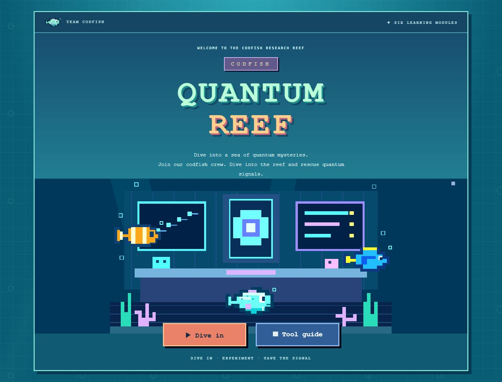
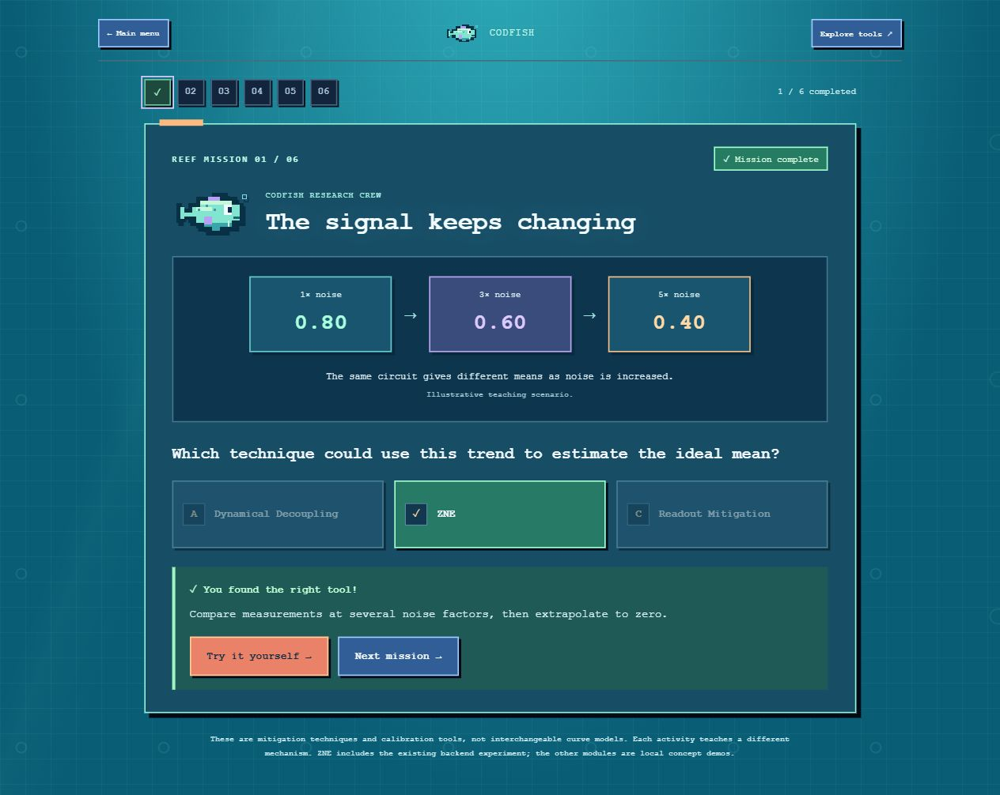

# CODFISH — Quantum Reef

A colorful pixel-art learning game about quantum noise and error mitigation. Built with React, Python/FastAPI, and a Qiskit IBM Runtime adapter. Runs on macOS, Windows and Linux.




## Current version

- **Start mission: Qubits vs Noise**, a lane-defence campaign (ported from [quantumGame](https://github.com/EDHE08232001/quantumGame)) restyled as a CODFISH reef mission. Errors march down five qubit wires; you defend them with ZNE, dynamical decoupling, TREX and Pauli twirling, each dealing ×2 damage to the error type it is built for and ×½ to the rest:
  - Seven levels plus an endless mode, each opening with a crew briefing on the new error and technique, and ending with a checkpoint question.
  - Technique briefings and defeat screens link straight to the matching lab (ZNE, Pulse Patrol, Shuffle the Error, Detector Decoder).
  - A Quantum Almanac (techniques, errors, matchups, practice quiz) and a How to play page.
  - Progress and stars are saved in the browser (`localStorage`); open `/?unlockAll` to play any level. Everything runs in the browser; it does not call the backend.
- **Tool quiz**: six scenario questions with three answer choices, hints, completion checks, and session progress.
- A separate toolkit for exploring each mini-game.
- ZNE: backend-generated teaching measurements, linear/exponential extrapolation, and an optional IBM hardware adapter.
- **Dynamical decoupling (Pulse Patrol)**: an interactive lab backed by `backend/dd_demo`:
  - *Learn*: what DD is, plus a real-time "flip it yourself" spin-echo playground.
  - *Levels 1–4*: place π pulses on a timeline and watch 12 sample runs on the "reef ring". The backend simulates each level with seeded noise: constant drift (Hahn echo), slow 1/f drift (CPMG trains), 5% pulse errors (XY4 alternation), and white noise (where DD cannot help).
  - *Level 5*: real `ibm_quebec` measurements with and without DD, plus interpretation questions.
  - *IBM lab*: browse every saved hardware run and, when IBM is enabled, submit new DD jobs from the browser.
  - *Sandbox*: compare free / Hahn / CPMG / UDD / XY4 under any noise with the theory model or the exact circuit simulation.
- **Pauli twirling (Shuffle the Error)**: an interactive lab backed by `backend/twirl_demo`, running a transverse-field Ising quench unmitigated and twirled:
  - *Learn*: what a Pauli frame is, plus a "shuffle it yourself" playground contrasting N with √N error growth.
  - *Level 1*: the actual quench circuit drawn without and with Pauli frames, every frame listed, and a server-side proof that the noiseless outcome is identical.
  - *Levels 2–4*: run both treatments on Qiskit Aer with a coherent ZZ crosstalk (twirling helps a lot), two-qubit depolarizing noise (twirling does nothing, because a Pauli channel is its own twirl), and both at once (only the coherent half goes).
  - *Twirl lab*: choose Qiskit Aer or a real IBM processor, set the problem size, randomizations and shots per randomization, dial the noise, browse saved runs, and compare every run made in the session.
- Readout mitigation, PEC, and noise learning: simplified local concept activities.

The DD simulator (`backend/dd_demo/src/fastsim.py`) is tested against Qiskit `Statevector` to machine precision. The twirling module's frame tables are checked against explicit matrices and its twirled circuits against the bare statevector; its four scenario lessons are asserted in `backend/twirl_demo/src/game.py`. The IBM data in DD level 5 are real measurements from a single qubit on a single day. **ZNE IBM hardware integration is not yet verified with a real job**, and the DD and twirling web submission paths are tested with mocks only; the twirling hardware path has been verified offline against FakeTorino. The command-line `python main.py hardware` produced the bundled `ibm_quebec` result. QML is not implemented. Tool quiz and lab progress resets on refresh; Qubits vs Noise progress is kept in the browser. Do not present synthetic teaching data as hardware measurements.

## Run locally

Prerequisites: Python 3.12+ and Node.js 22.12+.

### macOS / Linux (zsh or bash)

```zsh
python3 -m venv .venv
source .venv/bin/activate
pip install -r backend/requirements.txt
npm --prefix frontend ci
./start-local.sh            # or: python start_local.py --open
```

### Windows (PowerShell)

```powershell
python -m venv .venv
.\.venv\Scripts\python.exe -m pip install -r backend/requirements.txt
npm.cmd --prefix frontend ci
.\.venv\Scripts\python.exe start_local.py --open
```

`start_local.py` is the cross-platform launcher. It picks free ports (defaults 8000/5173, advancing if occupied), waits until both servers answer, prints the `Ready:` URL and stops both servers on Ctrl+C. Logs go to `.local/`. The older background launcher `.\start-local.ps1` still works on Windows: it prints process IDs and a stop command.

Alternatively run two terminals (use `.venv/bin/python` on macOS/Linux):

```powershell
.\.venv\Scripts\python.exe -m uvicorn backend.app:app --host 127.0.0.1 --port 8000
```

```powershell
cd frontend
npm.cmd run dev        # macOS/Linux: npm run dev
```

## IBM credentials

Set these before starting the services. Keep credentials out of Git and out of the browser. The same variables enable IBM mode for ZNE, the DD lab and the twirl lab.

The easiest way is a `backend/.env` file (ignored by Git), which the backend loads on startup; variables already set in the shell take precedence:

```dotenv
IBM_ENABLE=true
IBM_QUANTUM_TOKEN=<your API key>
IBM_BACKEND=ibm_quebec
# Optional: only needed if your key can reach several instances and you want a specific one.
IBM_QUANTUM_INSTANCE=
```

Or set them in the shell:

```powershell
$env:IBM_ENABLE = 'true'
$env:IBM_QUANTUM_TOKEN = '<your API key>'
$env:IBM_QUANTUM_INSTANCE = '<your instance CRN>'   # optional
$env:IBM_BACKEND = '<accessible QPU backend>'
.\.venv\Scripts\python.exe start_local.py
```

macOS/Linux:

```zsh
export IBM_ENABLE=true IBM_QUANTUM_TOKEN='<your API key>' IBM_BACKEND='<backend>'   # IBM_QUANTUM_INSTANCE is optional
./start-local.sh
```

Restart the backend after changing configuration. The web app reads `backend/.env` (or a repo-root `.env`); the standalone command lines read their own folder's `.env` (see `backend/dd_demo/README.md` and `backend/twirl_demo/README.md`). IBM mode submits real jobs and uses your account allocation.

- **ZNE**: submits three manually folded circuits through SamplerV2. Python derives means from counts and fits the extrapolation; this is not built-in Sampler ZNE. The ideal reference is calculated separately. Mitigation is not guaranteed to improve a result.
- **DD lab**: submits one Ramsey sweep per selected mode (no DD, IBM runtime XX / XpXm / XY4, or the manual `PadDynamicalDecoupling` pass) on the chosen qubit. When all jobs finish, the result is saved to `backend/dd_demo/results/hardware_<backend>_<timestamp>.json` and appears in the IBM lab. Only one DD hardware run can be active at a time.
- **Twirl lab**: submits both treatments in a single job — the bare ISA circuit repeated, followed by the twirled randomizations — so that drifting device noise cannot favour one of them. The Pauli frames are added after transpilation using only `x` and `rz(π)`, and the Sampler's own gate twirling and dynamical decoupling are switched off. Hardware runs are capped at 32 randomizations and use `2 · randomizations · shots` shots in total. The result is saved to `backend/twirl_demo/results/twirl_<backend>_<timestamp>.json` and appears in the lab's saved-run list. Only one twirling hardware run can be active at a time.

## Validation

macOS/Linux shown; on Windows use `.\.venv\Scripts\python.exe` and `npm.cmd`.

```zsh
.venv/bin/python -m unittest discover -s backend/tests -v      # API, ZNE, DD and twirling games, mocked IBM paths
.venv/bin/python -m pip install -r backend/dd_demo/requirements.txt
(cd backend/dd_demo && ../../.venv/bin/python -m pytest -q)     # standalone DD demo tests
(cd backend/twirl_demo && ../../.venv/bin/python -m pytest -q)  # standalone twirling demo tests
npm --prefix frontend run test:unit                             # Qubits vs Noise engine, including "is every level winnable?"
npm --prefix frontend run build
```

For browser tests, start both services first:

```zsh
cd frontend
npx playwright install chromium
ZNE_TEST_URL=http://127.0.0.1:5173 npx playwright test          # PowerShell: $env:ZNE_TEST_URL = '...'; npx.cmd playwright test
```

Use the actual launcher URL if its port differs. Backend tests use mocks and do not submit IBM jobs.

## Project structure

- `frontend/src/LearningHub.jsx`: cover, tool quiz, toolkit, and concept activities.
- `frontend/src/QubitsVsNoise.jsx`: the Start mission game (level chips, HUD, battlefield, briefings, results, How to play).
- `frontend/src/qvn/`: Qubits vs Noise logic carried over unchanged from quantumGame (`engine.js`, `data.js`, `levels.js`, `constants.js`, `sound.js`; `storage.js` only renames its `localStorage` key), the reef-themed canvas renderer (`renderer.js`), the Almanac and shared UI parts.
- `frontend/unit/`: Node tests for the game engine and the balance-testing bot.
- `frontend/src/codfishSprites.js`: pixel fish shared by `<Codfish/>` and the game canvas.
- `frontend/src/DDGame.jsx`: Pulse Patrol, the dynamical decoupling lab.
- `frontend/src/TwirlGame.jsx`: Shuffle the Error, the Pauli twirling lab.
- `frontend/src/Codfish.jsx`: pixel fish variants.
- `frontend/src/main.jsx`: ZNE game and chart.
- `backend/app.py`: experiment API and persisted runs.
- `backend/dd_api.py`: `/api/dd/*` routes (levels, play, explore, hardware datasets, IBM runs).
- `backend/twirl_api.py`: `/api/twirl/*` routes (scenarios, circuit preview, Aer runs, hardware datasets, IBM runs).
- `backend/core.py`: sampling, means, fitting, and uncertainty.
- `backend/ibm_adapter.py`: Qiskit circuits and IBM submission/results for ZNE, plus shared IBM credentials.
- `backend/dd_demo/`: standalone DD package and CLI (theory, circuits, noise, IBM runner, game scenarios). See its README.
- `backend/twirl_demo/`: standalone Pauli twirling package and CLI (TFIM quench, frame tables, Aer noise models, ISA twirling, IBM runner). See its README.
- `start_local.py`, `start-local.sh`, `start-local.ps1`: launchers.
- `docs/ZNE-technical-notes.md`: detailed ZNE notes in Chinese.

This is a local prototype. Authentication, multi-user isolation, and public-deployment controls are not implemented.
